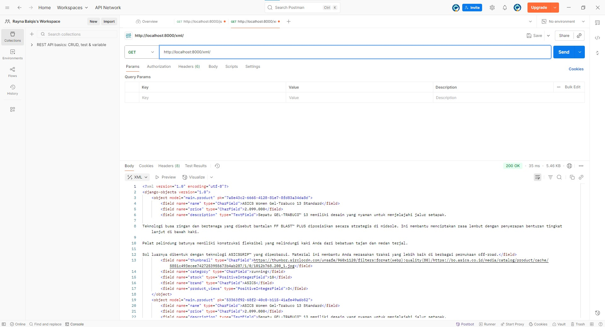
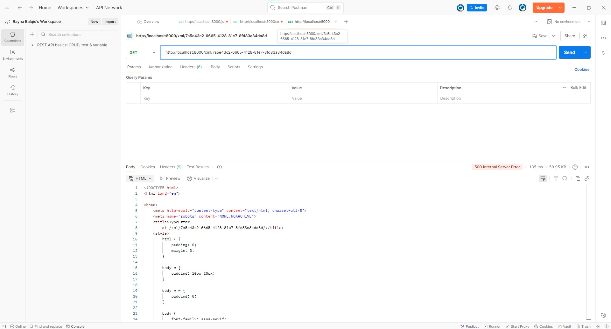
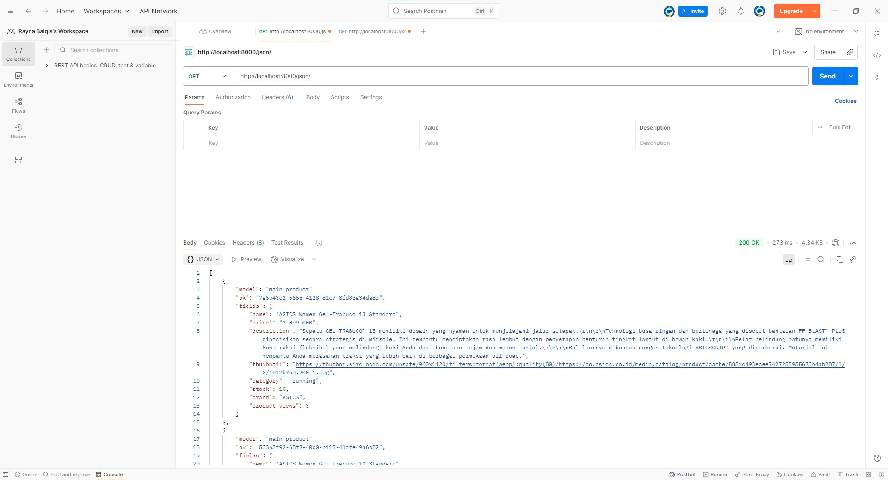
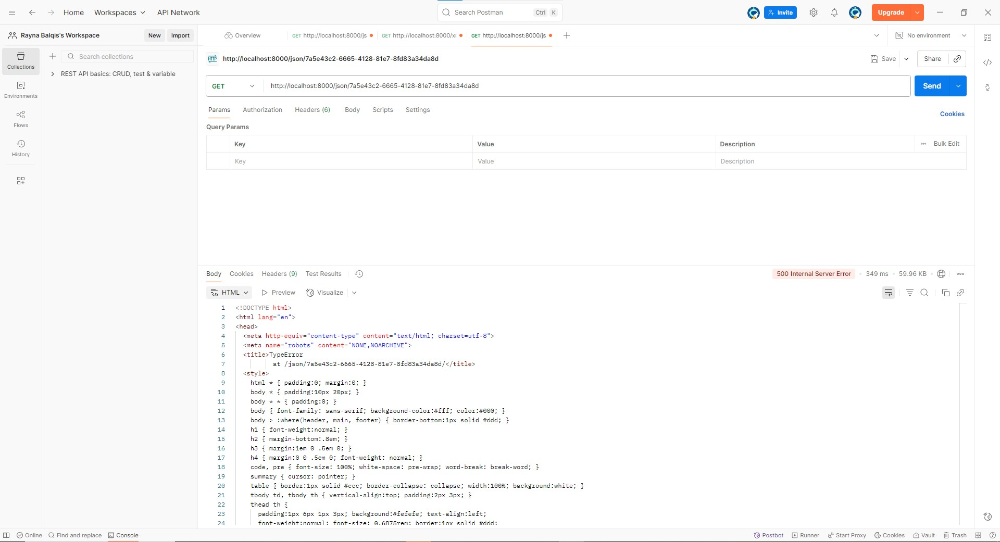

# Link deployment

https://rayna-balqis-decathlan.pbp.cs.ui.ac.id/

# Soal dan jawaban TI 2

## 1. Cara membuat proyek Django baru

1. menginstall django
2. membuat proyek django dengan perintah 
`django-admin startproject [nama proyek]`

## 2. Cara membuat aplikasi dengan nama main

1. menjalankan perintah 
`python manage.py startapp main`
2. menambahkan 'main' ke dalam INSTALLED_APPS pada settings.py
3. menghubungkan direktori main dengan proyek utama melalui urls.py
4. membuat file urls.py di folder main dan menambahkan app_name serta urlpatterns
5. menambahkan fungsi view di views.py untuk menampilkan response
6. menjalankan perintah 
`python manage.py runserver`

## 3.Cara melakukan routing pada agar dapat menjalankan aplikasi main
1. membuat berkas urls.py di dalam folder main
2. menambahkan app_name = 'main' pada main/urls.py
3. menambahkan daftar urlpatterns pada main/urls.py
4. membuat fungsi view di views.py untuk dihubungkan dengan path
5. mengimport include dari django.urls pada urls.py di direktori utama
6. menambahkan path('main/', include('main.urls')) ke dalam urlpatterns di project utama
## 4. Cara membuat model pada aplikasi main dengan nama Product dan memiliki atribut wajib 
Menambahkan class Product pada models.py lalu menambahkan atribut dengan requirements yang tertera  
`name sebagai nama item dengan tipe CharField. ` 
`price sebagai harga item dengan tipe IntegerField. ` 
`description sebagai deskripsi item dengan tipe TextField. ` 
`thumbnail sebagai gambar item dengan tipe URLField.  `
`category sebagai kategori item dengan tipe CharField.  `
`is_featured sebagai status unggulan item dengan tipe BooleanField.  `
## 5. Cara membuat fungsi pada views.py untuk dikembalikan ke dalam sebuah template HTML yang menampilkan nama aplikasi serta nama dan kelas 
1. membuat folder templates/main/ di dalam direktori aplikasi main
2. membuat file main.html di dalam folder tersebut
3. menambahkan fungsi bernama show_main pada views.py yang berisi variabel (misalnya app_name, nama, kelas)
4. mengembalikan fungsi tersebut dengan render(request, "main/main.html", context)
5. menambahkan path baru di main/urls.py untuk memanggil fungsi show_main
## 6. Cara membuat sebuah routing pada urls.py aplikasi main untuk memetakan fungsi yang telah dibuat pada views.py
1. membuka atau membuat file urls.py di dalam folder main
2. mengimpor fungsi include dan path dari django.urls
3. mengimpor fungsi show_main dari views.py
4. menambahkan path baru di urlpatterns
## 7. Cara melakukan deployment ke PWS terhadap aplikasi yang sudah dibuat sehingga nantinya dapat diakses oleh teman-temanmu melalui Internet
Setelah memastikan bahwa proyek ini sudah diset url dengan link proyek pws, melakukan add, commit dan push kepada keduanya, github dan pws. Secara otomatis aplikasi dideploy melalui PWS
## 8. Buatlah bagan yang berisi request client ke web aplikasi berbasis Django beserta responnya dan jelaskan pada bagan tersebut kaitan antara urls.py, views.py, models.py, dan berkas html.


urls.py menerima request dan menentukan viewmana yang akan bertanggung jawab, lalu views.py akan menjalankan logic dan interact dengan models.py yang akan berkomunikasi dengan database untuk ambil/simpan data, dan template html akan merender halaman dengan data yang sudah berikan

## 9. Jelaskan peran settings.py dalam proyek Django!
Settings.py berfungsi sebagai file konfigurasi pada sebuah proyek django. Pengaturan inti seperikoneksi database, aplikasi apa saja yang digunakan, keamanan, sampai konfigurasi yang statis dilakukan oleh settings.py.
## 10. Bagaimana cara kerja migrasi database di Django?
Dengan cara mentranslate perubahan pada models.py menjadi perubahan pada skema database menggunakan file migrations  

1. Mengubah atau membuat model di models.py  
2. Django melihat ada perubahan model  
3. Menjalankan python manage.py makemigrations  

Intinya step ini dilakukan setiap ada perubahan pada models.py

## 11. Menurut Anda, dari semua framework yang ada, mengapa framework Django dijadikan permulaan pembelajaran pengembangan perangkat lunak?
Menurut saya, django cukup cocok dijadikan permulaan bagi seseorang yang ingin belajar pengembangan perangkat lunak karena:
1. Menggunakan python (bahasa yang cukup mudah untuk dipelajari)
2. Fitur bawaan lengkap
3. Menggunakan pola arsitektur yang terorganisi (MVT)

## 12. Apakah ada feedback untuk asisten dosen tutorial 1 yang telah kamu kerjakan sebelumnya?
Tidak ada, overall good. Thankyou asdos PBP :D


# Soal dan jawaban TI 2

## 1. Jelaskan mengapa kita memerlukan data delivery dalam pengimplementasian sebuah platform?
Karena ada proses pertukaran data dari server ke client. Jadi data delivery yang menjadi jembatan untuk menghubungkan antara backend dengan frontend. Tanpa mekanisme data delivery, frontend tidak bisa tahu data apa yang ada di server.

## 2. Menurutmu, mana yang lebih baik antara XML dan JSON? Mengapa JSON lebih populer dibandingkan XML?
Menurut saya, JSON lebih baik :D dibandingkan dengan XML, JSON lebih dapat "dibaca" oleh mata manusia dibandingkan dengan XML yang memiliki banyak tag, walaupun JSON kurang cocok untuk data dengan struktur yang kompleks. JSON lebih populer dibandingkan dengan XML karena lebih ringkas dan efisien, selain itu JSON bisa dipake langsung tanpa parsing tambahan.

## 3. Jelaskan fungsi dari method is_valid() pada form Django dan mengapa kita membutuhkan method tersebut?
fungsi dari method `is_valid ` adalah untuk mengecek apakah semua form yang ada sudah terisi sesuai dengan aturan model yang ada. Kita membutuhkan method tersebut untuk mencegah data yang tidak valid masuk ke dalam database.

## 4. Mengapa kita membutuhkan csrf_token saat membuat form di Django? Apa yang dapat terjadi jika kita tidak menambahkan csrf_token pada form Django? Bagaimana hal tersebut dapat dimanfaatkan oleh penyerang?
csrf_token berfungsi untuk melindungi aplikasi dari serangan cross site request forgery (CSRF). Tanpa csrf_token, attacker bisa mengubah data tanpa seizin user, misal mengganti data-data privasi seperti password, pin ATM, nomor identitas, dan sebagainya yang seharusnya butuh interaksi langsung dari user. Hal ini dilakukan oleh attacker dengan cara mengandalkan cookie session yang biasanya otomatis terkirim oleh browser, jadi walaupun user tidak tahu, requestnya tetap terlihat valid di sisi server, dengan kata lain, dengan adanya csrf_token, server dapat membedakan request asli dan palsu.
## 5. Jelaskan bagaimana cara kamu mengimplementasikan checklist di atas secara step-by-step 

1. Menambah keempat fungsi tersebut pada views.py dan tidak lupa untuk import productform dan product

```python
from django.shortcuts import render, redirect, get_object_or_404
from django.http import HttpResponse
from django.core import serializers
from main.forms import ProductForm
from main.models import Product

def show_xml(request):
    product_list = Product.objects.all()
    xml_data = serializers.serialize("xml", product_list)
    return HttpResponse(xml_data, content_type="application/xml")

def show_json(request):
    product_list = Product.objects.all()
    json_data = serializers.serialize("json", product_list)
    return HttpResponse(json_data, content_type="application/json")

def show_xml_by_id(request, product_id):
   try:
       news_item = Product.objects.filter(pk=product_id)
       xml_data = serializers.serialize("xml", news_item)
       return HttpResponse(xml_data, content_type="application/xml")
   except Product.DoesNotExist:
       return HttpResponse(status=404)
   
def show_json_by_id(request, product_id):
   try:
       product_item = Product.objects.get(pk=product_id)
       json_data = serializers.serialize("json", [product_item])
       return HttpResponse(json_data, content_type="application/json")
   except Product.DoesNotExist:
       return HttpResponse(status=404)
```

2. Menambahkan path API endpoints dari keempat fungsi tersebut di urls.py
``` python
path('xml/', show_xml, name='show_xml'),
path('json/', show_json, name='show_json'),
path('xml/<str:news_id>/', show_xml_by_id, name='show_xml_by_id'),
path('json/<str:news_id>/', show_json_by_id, name='show_json_by_id'),
```

3. Membuat file forms.py yang berisi models dan template yang sesuai
```python
from django.forms import ModelForm
from main.models import Product

class ProductForm(ModelForm):
    class Meta:
        model = Product
        fields = ["name", "price", "description","category", "thumbnail", "stock", "brand"]
```
4. Mengubah main.html di dalam templates yang ada di direktori main
```python
<h1>Product List</h1>

<h5>NPM:</h5>
<p>{{ npm }}</p>

<h5>Name:</h5>
<p>{{ name }}</p>

<h5>Class:</h5>
<p>{{ class }}</p>

<a href="">
  <button>+ Add Product</button>
</a>

<hr>


  <p>Belum ada data produk.</p>



<div>
  <h2>
    <a href="">
      {{ product.name }}
    </a>
  </h2>

  <p>
    <b>{{ product.get_category_display }}</b>
     | <b>Hot</b>
    | Views: {{ product.product_views }}
  </p>

  
    
    <br />
  

  <p>{{ product.description|truncatewords:25 }}...</p>

  <p>
    <a href="">
      <button>View Details</button>
    </a>
  </p>
</div>

<hr>



```
5. Menambah template form dengan nama create_product di templates yang ada di direktori main

```python
 

<h1>Add New Product</h1>

<form method="POST">
  
  <table>
    {{ form.as_table }}
    <tr>
      <td></td>
      <td>
        <input type="submit" value="Add New Product" />
      </td>
    </tr>
  </table>
</form>


```

6. Menambah template detail dengan nama product_detail di templates yang ada di direktori main
```python


<p>
  <a href="">
    <button>← Back to Product List</button>
  </a>
</p>

<h1>{{ product.name }}</h1>

<p>
  <b>{{ product.get_category_display }}</b>
   | <b>Hot</b>
  | Views: {{ product.product_views }}
</p>


  
  <br /><br />


<p><b>Brand:</b> {{ product.brand|default:"N/A" }}</p>
<p><b>Price:</b> Rp {{ product.price }}</p>
<p><b>Stock:</b> {{ product.stock }}</p>
<p><b>Description:</b> {{ product.description }}</p>


```
7. Jalankan migrasi
`python manage.py makemigrations`
`python manage.py migrate`

8. Jalankan server

`python manage.py runserver`

## 6. Apakah ada feedback untuk asdos di tutorial 2 yang sudah kalian kerjakan?
Tidak


## Lampiran gambar postman




